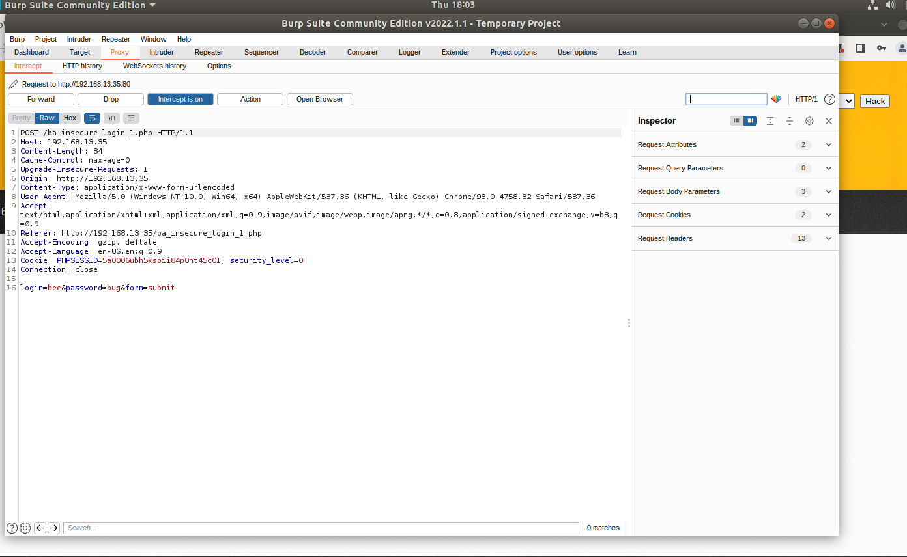

## Week 16 Homework Submission File: Web vulnerabilities and Hardening 

Web Application 1: Your Wish is My Command Injection

1. Deliverable: Take a screen shot confirming that this exploit was successfully executed and provide 2-3 sentences outlining mitigation strategies.

The main problem with command injection are web applications that are not set up with user input validation protocols. Security professionals can use a whitelisting approach to validate user input only allowing certain IP addresses and search queries in the search bar on your web application. Anything beyond the approved list will be denied. Also if sensitive files are hosted on a segregated network is another mitigation strategy. Source: https://resources.infosecinstitute.com/topic/how-to-mitigate-command-injection-vulnerabilities/

    Web Application 2: A Brute Force to Be Reckoned With

2.Deliverable: Take a screen shot confirming that this exploit was successfully executed and provide 2-3 sentences outlining mitigation strategies.

Captured the POST request in burpsuite sent it to intruder to isolate the username and password fields. Entered the payloads for field 1 and 2 from the breached intel. 

The attack did result in a sucessful login for tonystark and I am Iron Man

Mitigation strategies are multifactor authentication. Stronger lockout guidelines that requre passwords to be changed after a shorter time period and require a more complex combination of letters, numbers, and special characters. Enable lockout requirements that only allow a certain number of failed login attempts. 

    Web Application 3: Where's the BeEF?

3. Deliverable: Take a screen shot confirming that this exploit was successfully executed and provide 2-3 sentences outlining mitigation strategies.

Was able to inject malicious code into the message field on http://192.168.13.25/vulnerabilities/xss_s/. By inspect the HTML code I deleted the max field parameter of 50. Created a zombie of the web application. 

With my new zombie browser I sent the command to create a fake facebook login to attempt to obtain credentials. 

Sent the command to create a fake popup bar. 

Sent a command to obtain the users home location.

Sent a fake adobe flash popup to potential install a keylogger or ransomware.

Mitigation strategies 

    Again content validation for any search fields to deny any file types being entered in a search field not expected to receive files or code. Content security policy needs to prevent browser exploitation attacks. 

