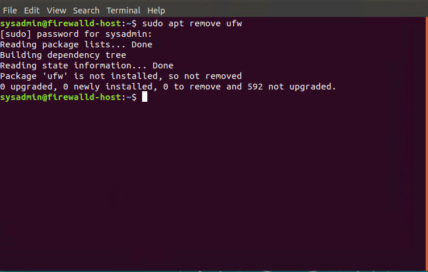
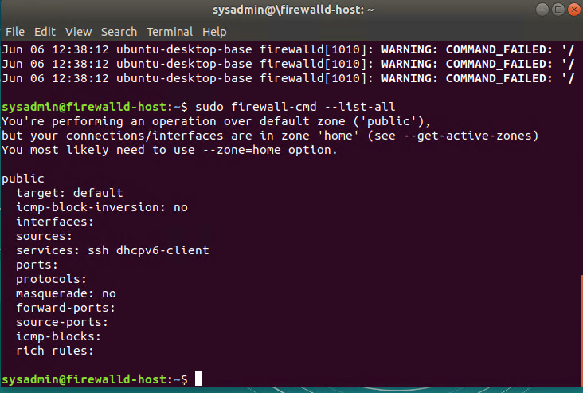
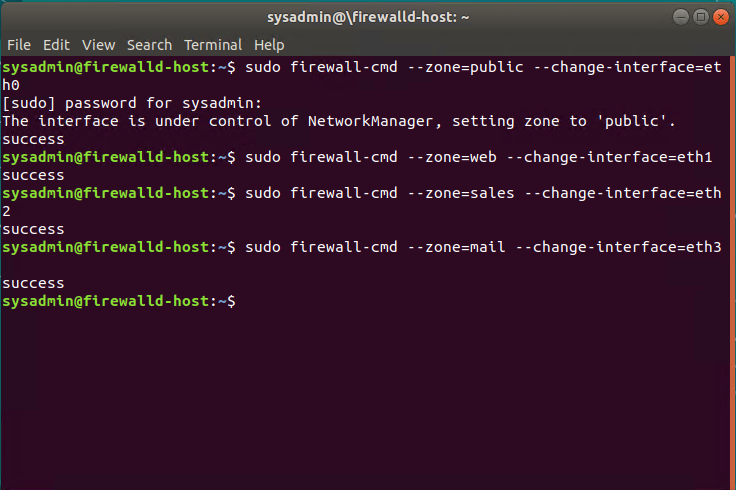
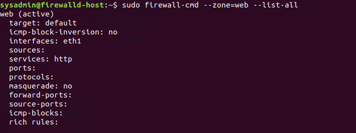

## Unit 11 Submission File: Network Security Homework 

### Part 1: Review Questions 

#### Security Control Types

The concept of defense in depth can be broken down into three different security control types. Identify the security control type of each set  of defense tactics.

1. Walls, bollards, fences, guard dogs, cameras, and lighting are what type of security control?

    Answer: Physical Controls  

2. Security awareness programs, BYOD policies, and ethical hiring practices are what type of security control?

    Answer: Administrative Controls 

3. Encryption, biometric fingerprint readers, firewalls, endpoint security, and intrusion detection systems are what type of security control?

    Answer:  Technical or Operational Controls 

#### Intrusion Detection and Attack indicators

1. What's the difference between an IDS and an IPS?

    Answer:Both IDS and IPS analyze traffic and look for malicious signatures, however,IPS can react to attacks by blocking malicious traffic, preventing it from being delivered.

2. What's the difference between an Indicator of Attack and an Indicator of Compromise?

   Answer:    An indicator of attack simply means a threat attacker has attempted to gain entry to the network and indicator of compromise means there is evidence that the attack was successful and they were able to enter the network. 

#### The Cyber Kill Chain

Name each of the seven stages for the Cyber Kill chain and provide a brief example of each.

1. Stage 1: Reconnaissance for example the gathering of PII to sell on the dark web. 

2. Stage 2: Weaponization for example the creation of ransomware.

3. Stage 3: Delivery for example clicking on a malicious link in a phishing email. 

4. Stage 4: Exploitation as ransomware installs on the target network and creates a backdoor into the system.

5. Stage 5: Installation ransomware notifying attacker of a successful infection. 

6. Stage 6: Command and Control a malicious actor being able to take control of a system and move about looking for PII or other valuable data.

7. Stage 7: Actions on Objectives for example achieving control of the host computer and starting to encrypt target files.  


#### Snort Rule Analysis

Use the Snort rule to answer the following questions:

Snort Rule #1

```bash
alert tcp $EXTERNAL_NET any -> $HOME_NET 5800:5820 (msg:"ET SCAN Potential VNC Scan 5800-5820"; flags:S,12; threshold: type both, track by_src, count 5, seconds 60; reference:url,doc.emergingthreats.net/2002910; classtype:attempted-recon; sid:2002910; rev:5; metadata:created_at 2010_07_30, updated_at 2010_07_30;)
```

1. Break down the Snort Rule header and explain what is happening.

   Answer: Apply this rule to all TCP packets to any IP address from ports 5800 to 5820 going to the home network with a message ET SCAN Potential VNC Scan 5800-5820. 

2. What stage of the Cyber Kill Chain does this alert violate?

   Answer: Reconnaisance attackers probing for weakness and gathering intel. 

3. What kind of attack is indicated?

   Answer: Port mapping 

Snort Rule #2

```bash
alert tcp $EXTERNAL_NET $HTTP_PORTS -> $HOME_NET any (msg:"ET POLICY PE EXE or DLL Windows file download HTTP"; flow:established,to_client; flowbits:isnotset,ET.http.binary; flowbits:isnotset,ET.INFO.WindowsUpdate; file_data; content:"MZ"; within:2; byte_jump:4,58,relative,little; content:"PE|00 00|"; distance:-64; within:4; flowbits:set,ET.http.binary; metadata: former_category POLICY; reference:url,doc.emergingthreats.net/bin/view/Main/2018959; classtype:policy-violation; sid:2018959; rev:4; metadata:created_at 2014_08_19, updated_at 2017_02_01;)
```

1. Break down the Sort Rule header and explain what is happening.

   Answer: Any TCP packet going from port 80 

2. What stage of the Cyber Kill Chain does this alert violate?

   Answer: Delivery 

3. What kind of attack is indicated?

   Answer: Cross site scripting the injecting of  malicous code into a vulnerable web page. Can be used to copy a user's cookies to spoof the users credentials to gain access to PII. 

Snort Rule #3

- Your turn! Write a Snort rule that alerts when traffic is detected inbound on port 4444 to the local network on any port. Be sure to include the `msg` in the Rule Option.

    Answer: alert TCP any any -> any 4444{msg: "IP traffic to port 4444 detected"

    )

### Part 2: "Drop Zone" Lab

#### Log into the Azure `firewalld` machine

Log in using the following credentials:

- Username: `sysadmin`
- Password: `cybersecurity`

#### Uninstall `ufw`

Before getting started, you should verify that you do not have any instances of `ufw` running. This will avoid conflicts with your `firewalld` service. This also ensures that `firewalld` will be your default firewall.

- Run the command that removes any running instance of `ufw`.





#### Enable and start `firewalld`

By default, these service should be running. If not, then run the following commands:

- Run the commands that enable and start `firewalld` upon boots and reboots.


  Note: This will ensure that `firewalld` remains active after each reboot.

#### Confirm that the service is running.

- Run the command that checks whether or not the `firewalld` service is up and running.


#### List all firewall rules currently configured.

Next, lists all currently configured firewall rules. This will give you a good idea of what's currently configured and save you time in the long run by not doing double work.

- Run the command that lists all currently configured firewall rules:





- Take note of what Zones and settings are configured. You may need to remove unneeded services and settings.

#### List all supported service types that can be enabled.

- Run the command that lists all currently supported services to see if the service you need is available


- We can see that the `Home` and `Drop` Zones are created by default.


#### Zone Views

- Run the command that lists all currently configured zones.


- We can see that the `Public` and `Drop` Zones are created by default. Therefore, we will need to create Zones for `Web`, `Sales`, and `Mail`.

#### Create Zones for `Web`, `Sales` and `Mail`.

- Run the commands that creates Web, Sales and Mail zones.


#### Set the zones to their designated interfaces:

- Run the commands that sets your `eth` interfaces to your zones.




#### Add services to the active zones:

- Run the commands that add services to the **public** zone, the **web** zone, the **sales** zone, and the **mail** zone.

- Public:


- Web:


- Sales


- Mail


- What is the status of `http`, `https`, `smtp` and `pop3`?


#### Add your adversaries to the Drop Zone.

- Run the command that will add all current and any future blacklisted IPs to the Drop Zone.


#### Make rules permanent then reload them:

It's good practice to ensure that your `firewalld` installation remains nailed up and retains its services across reboots. This ensure that the network remains secured after unplanned outages such as power failures.

- Run the command that reloads the `firewalld` configurations and writes it to memory


#### View active Zones

Now, we'll want to provide truncated listings of all currently **active** zones. This a good time to verify your zone settings.

- Run the command that displays all zone services.


#### Block an IP address

- Use a rich-rule that blocks the IP address `138.138.0.3`.


#### Block Ping/ICMP Requests

Harden your network against `ping` scans by blocking `icmp ehco` replies.

- Run the command that blocks `pings` and `icmp` requests in your `public` zone.


#### Rule Check

Now that you've set up your brand new `firewalld` installation, it's time to verify that all of the settings have taken effect.

- Run the command that lists all  of the rule settings. Do one command at a time for each zone.

 





- Are all of our rules in place? If not, then go back and make the necessary modifications before checking again.


Congratulations! You have successfully configured and deployed a fully comprehensive `firewalld` installation.

---

### Part 3: IDS, IPS, DiD and Firewalls

Now, we will work on another lab. Before you start, complete the following review questions.

#### IDS vs. IPS Systems

1. Name and define two ways an IDS connects to a network.

   Answer 1: Network intrusion detection system matches all traffic to a known library of attack signatures, examines network traffic, and it is easy to deploy hard to detect.

   Answer 2: Host based intrusion detection system is a second line of defense against traffic that gets through NIDS. Examines entire file systems on a host, compares them to previous snapshots and generates an alert if there is a significant difference. 

2. Describe how an IPS connects to a network.

   Answer: IPS connects via a network tap, mirrored port, or SPAN. 

3. What type of IDS compares patterns of traffic to predefined signatures and is unable to detect Zero-Day attacks?

   Answer: A signature based IDS would not detect a zero-day attack as it is good for identifying well-known attacks but is suspectible to new attacks until an update with the new attack signature is released. Is also vulnerable to packet manipulation that takes place during a zero-day attack. 

4. Which type of IDS is beneficial for detecting all suspicious traffic that deviates from the well-known baseline and is excellent at detecting when an attacker probes or sweeps a network?

   Answer:An Anomaly based IDS is great at detecting sweeps of a network and detects anomalies from a set baseline. 

#### Defense in Depth

1. For each of the following scenarios, provide the layer of Defense in Depth that applies:

    1.  A criminal hacker tailgates an employee through an exterior door into a secured facility, explaining that they forgot their badge at home.

        Answer: Physical for tailgating also administrative for an employee allowing someone to bypass set policy to gain access. 

    2. A zero-day goes undetected by antivirus software.

        Answer: Technical as an anomaly based software would detect a zero-day attack. 

    3. A criminal successfully gains access to HR’s database.

        Answer: Technical network issue

    4. A criminal hacker exploits a vulnerability within an operating system.

        Answer: Technical operating software issue 

    5. A hacktivist organization successfully performs a DDoS attack, taking down a government website.

        Answer: Technical 

    6. Data is classified at the wrong classification level.

        Answer: Administrative

    7. A state sponsored hacker group successfully firewalked an organization to produce a list of active services on an email server.

        Answer: Technical as threat actor was able to scan the firewall for vulnerabilities.

2. Name one method of protecting data-at-rest from being readable on hard drive.

    Answer: Encryption

3. Name one method to protect data-in-transit.

    Answer: VPN

4. What technology could provide law enforcement with the ability to track and recover a stolen laptop.

   Answer: Lojack for laptops that downloads software at the firmware level that has a tracking agent that calls out "Am I ok." Police call back no you are stolen call back in 15 minutes to collect GPS data. If the software is compromised it immediate downloads to latest version and is undetectable as it is on the firmware level. Source: https://www.techradar.com/news/computing/how-the-experts-track-a-stolen-laptop-1076388

5. How could you prevent an attacker from booting a stolen laptop using an external hard drive?

    Answer: Encrpting your hard drive. 


#### Firewall Architectures and Methodologies

1. Which type of firewall verifies the three-way TCP handshake? TCP handshake checks are designed to ensure that session packets are from legitimate sources.

  Answer: circuit-level gateway firewall

2. Which type of firewall considers the connection as a whole? Meaning, instead of looking at only individual packets, these firewalls look at whole streams of packets at one time.

  Answer: stateful firewalls 

3. Which type of firewall intercepts all traffic prior to being forwarded to its final destination. In a sense, these firewalls act on behalf of the recipient by ensuring the traffic is safe prior to forwarding it?

  Answer: packet proxy firewall 


4. Which type of firewall examines data within a packet as it progresses through a network interface by examining source and destination IP address, port number, and packet type- all without opening the packet to inspect its contents?

  Answer: packet filtering firewall


5. Which type of firewall filters based solely on source and destination MAC address?

  Answer: MAC filtering firewall 


### Bonus Lab: "Green Eggs & SPAM"
In this activity, you will target spam, uncover its whereabouts, and attempt to discover the intent of the attacker.
 
- You will assume the role of a Jr. Security administrator working for the Department of Technology for the State of California.
 
- As a junior administrator, your primary role is to perform the initial triage of alert data: the initial investigation and analysis followed by an escalation of high priority alerts to senior incident handlers for further review.
 
- You will work as part of a Computer and Incident Response Team (CIRT), responsible for compiling **Threat Intelligence** as part of your incident report.

#### Threat Intelligence Card

**Note**: Log into the Security Onion VM and use the following **Indicator of Attack** to complete this portion of the homework. 

Locate the following Indicator of Attack in Sguil based off of the following:

- **Source IP/Port**: `188.124.9.56:80`
- **Destination Address/Port**: `192.168.3.35:1035`
- **Event Message**: `ET TROJAN JS/Nemucod.M.gen downloading EXE payload`

Answer the following:

1. What was the indicator of an attack?
   - Hint: What do the details of the reveal? 

    Answer: 


2. What was the adversarial motivation (purpose of attack)?

    Answer: 

3. Describe observations and indicators that may be related to the perpetrators of the intrusion. Categorize your insights according to the appropriate stage of the cyber kill chain, as structured in the following table.

| TTP | Example | Findings |
| --- | --- | --- | 
| **Reconnaissance** |  How did they attacker locate the victim? | 
| **Weaponization** |  What was it that was downloaded?|
| **Delivery** |    How was it downloaded?|
| **Exploitation** |  What does the exploit do?|
| **Installation** | How is the exploit installed?|
| **Command & Control (C2)** | How does the attacker gain control of the remote machine?|
| **Actions on Objectives** | What does the software that the attacker sent do to complete it's tasks?|


    Answer: 


4. What are your recommended mitigation strategies?


    Answer: 


5. List your third-party references.

    Answer: 


---

© 2020 Trilogy Education Services, a 2U, Inc. brand. All Rights Reserved.
