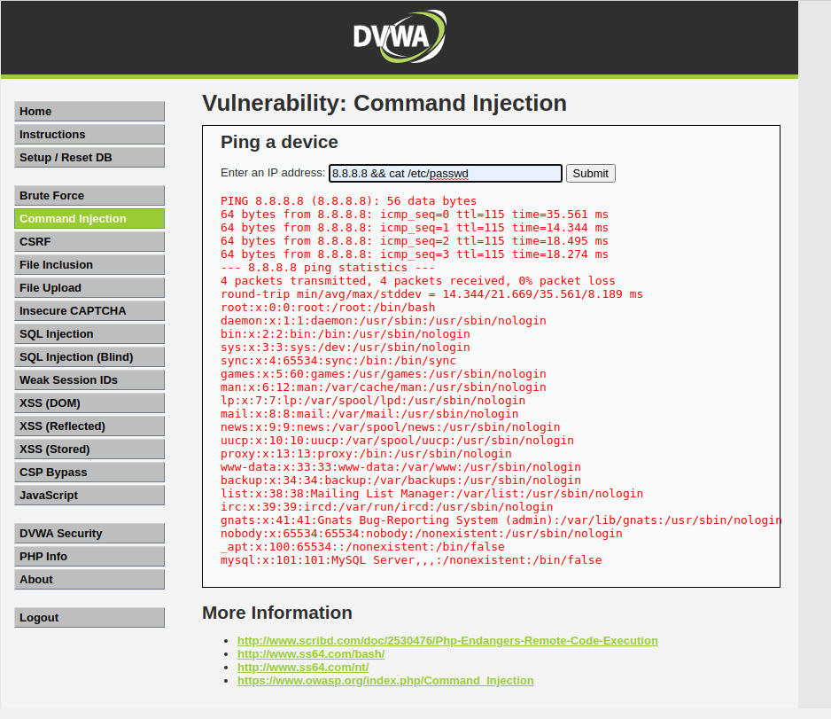
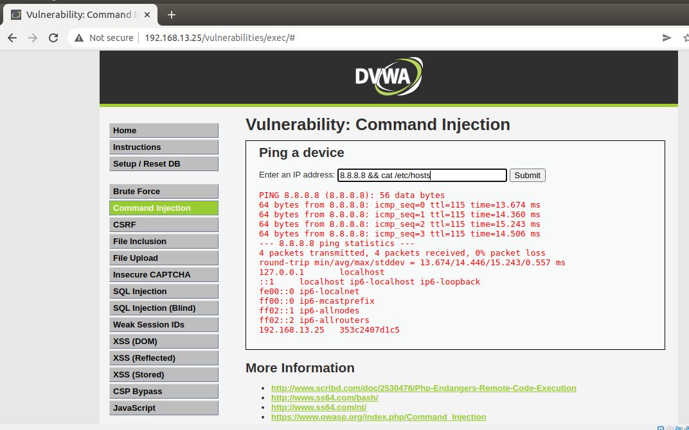

## Week 16 Homework Submission File: Web vulnerabilities and Hardening 

Web Application 1: Your Wish is My Command Injection

1. Deliverable: Take a screen shot confirming that this exploit was successfully executed and provide 2-3 sentences outlining mitigation strategies.

The main problem with command injection are web applications that are not set up with  user input validation protocols. Security professionals can use a whitelisting approach to validate user input only allowing certain IP addresses and search queries in the search bar on your web application. Anything beyond the approved list will be denied. Source: https://resources.infosecinstitute.com/topic/how-to-mitigate-command-injection-vulnerabilities/

    Web Application 2: A Brute Force to Be Reckoned With

2.Deliverable: Take a screen shot confirming that this exploit was successfully executed and provide 2-3 sentences outlining mitigation strategies.

