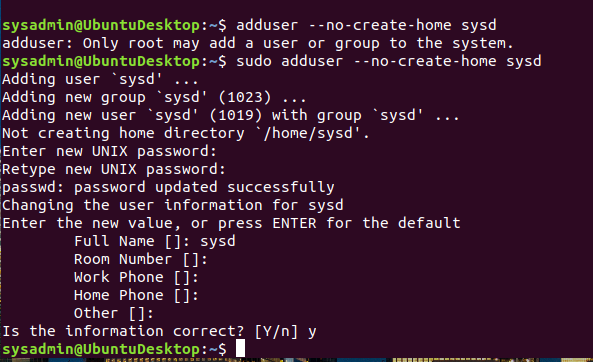

## Week 6 Homework Submission File: Advanced Bash - Owning the System

Please edit this file by adding the solution commands on the line below the prompt. 

Save and submit the completed file for your homework submission.

**Step 1: Shadow People** 

1. Create a secret user named `sysd`. Make sure this user doesn't have a home folder created:

        sysadmin@UbuntuDesktop:~$sudo adduser --no-create-home sysd

       

2. Give your secret user a password: 

        sysadmin@UbuntuDesktop:~$ sudo passwd sysd

3. Give your secret user a system UID < 1000:

        sysadmin@UbuntuDesktop:/etc$ sudo usermod -u 14 sysd

        

4. Give your secret user the same GID:

        sysadmin@UbuntuDesktop:/etc$ sudo groupmod -g 14 sysd

5. Give your secret user full `sudo` access without the need for a password:

        sysd ALL=(ALL) NOPASSWD:ALL

6. Test that `sudo` access works without your password:

        sysd@UbuntuDesktop:/$ sudo visudo

**Step 2: Smooth Sailing**

1. Edit the `sshd_config` file:

        sysadmin@UbuntuDesktop:/etc/ssh$ sudo nano sshd_config

**Step 3: Testing Your Configuration Update**
1. Restart the SSH service:

  sysadmin@UbuntuDesktop:/etc/ssh$ sudo systemctl reload ssh

2. Exit the `root` account:

        root:~\ $ su sysadmin

3. SSH to the target machine using your `sysd` account and port `2222`:
    - `Your solution command here`

4. Use `sudo` to switch to the root user:
    - `Your solution command here`

**Step 4: Crack All the Passwords**

1. SSH back to the system using your `sysd` account and port `2222`:

    - `Your solution command here`

2. Escalate your privileges to the `root` user. Use John to crack the entire `/etc/shadow` file:

    - `Your solution command here`

---

© 2020 Trilogy Education Services, a 2U, Inc. brand. All Rights Reserved.

