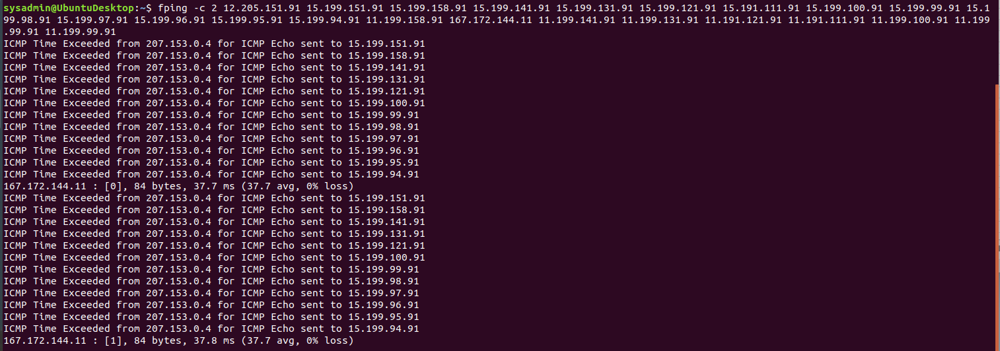
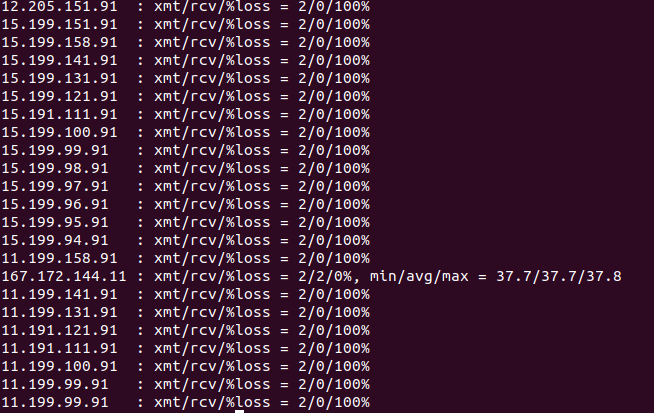

## Week 8 Homework Submission File: Networking Fundamentals 

Please edit this file by adding the solution commands on the line below the prompt. 

Save and submit the completed file for your homework submission.

Phase 1: "I'd like to Teach the World to Ping"

a) The steps and commands used to complete the tasks.

b) A summary of your findings for each testing phase.

c) Any network vulnerabilities discovered.

167.172.144.11 on the Hollywood application server is currently open and accepting connections. 

d) Findings associated with a hacker.

More research needs to be done to determine if this open IP address was the result of a hacker or setup error. 

e)Recommended mitigation strategy.

Close the IP address and research who set it up and any internet traffic to the IP address while it was open. 

f) Document the OSI layer where the findings were found.

This is in OSI layer 3 where the destination IP is added to the package. 