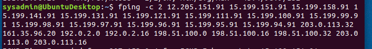
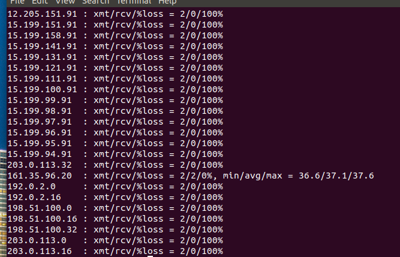
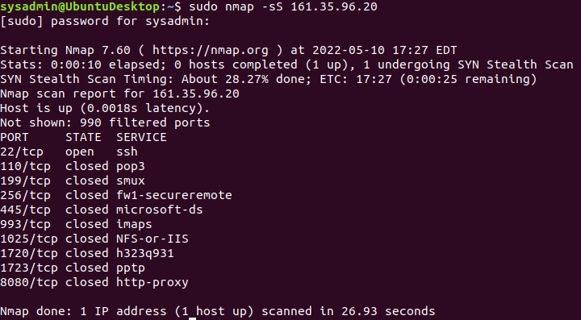
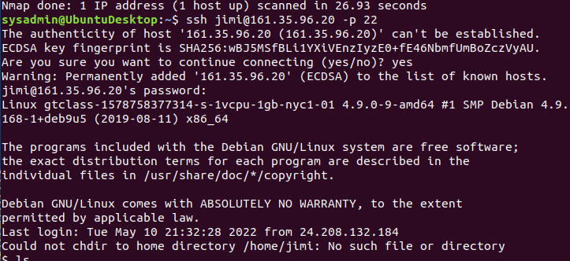
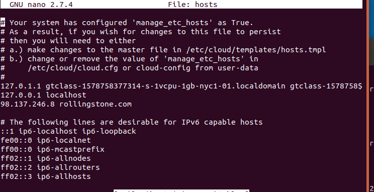
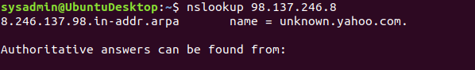
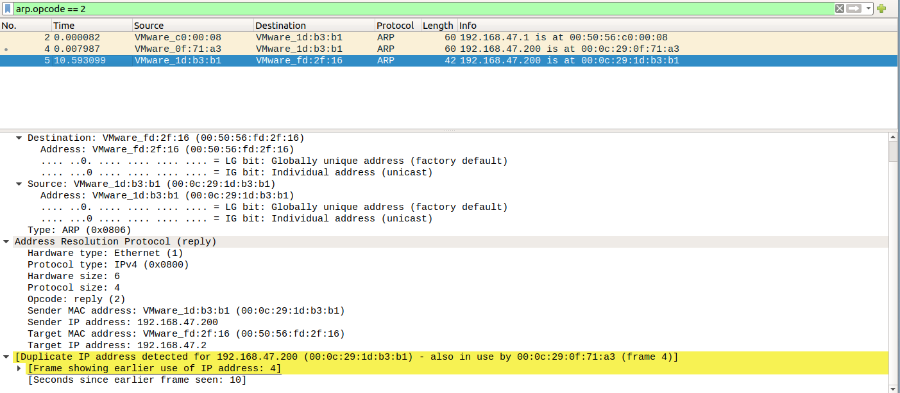
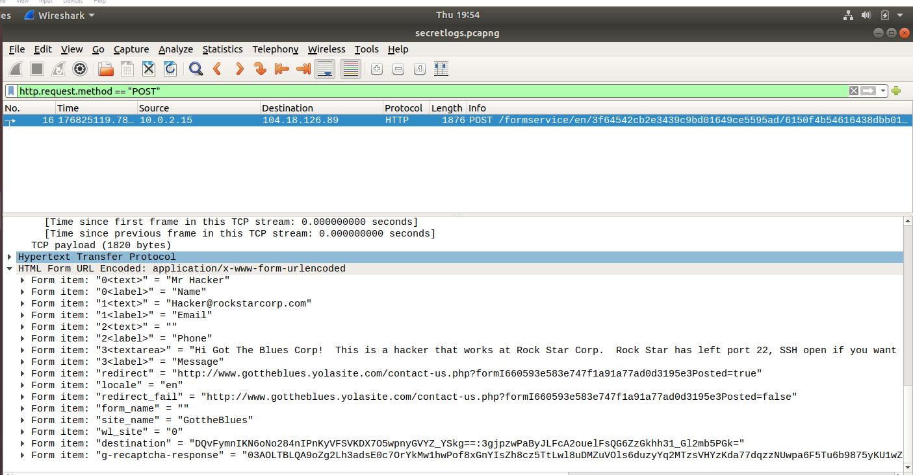

## Week 8 Homework Submission File: Networking Fundamentals 

Please edit this file by adding the solution commands on the line below the prompt. 

Save and submit the completed file for your homework submission.

Phase 1: "I'd like to Teach the World to Ping"

a) The steps and commands used to complete the tasks.

b) A summary of your findings for each testing phase.

c) Any network vulnerabilities discovered.

    161.35.96.20 on the Hollywood application server is currently open and accepting connections. Since Rockstar Corp doesn't want any requests, this is a vulnerability.

d) Findings associated with a hacker.

    More research needs to be done to determine if this open IP address was the result of a hacker or setup error. 

e)Recommended mitigation strategy.

    Close the IP address and research who set it up and analyze all internet traffic to the IP address while it was open. 

f) Document the OSI layer where the findings were found.

    This is in OSI layer 3 where the destination IP is added to the package. 

Phase 2:  "Some Syn for Nothin`"

a) List the steps and commands used to complete the tasks.

b) A summary of your findings for each testing phase.

    According the Nmap port 22 is open and accepting connections 

c) List any vulnerabilities discovered.

    Potential vulnerability as Port 22 should not be open.

d) List any findings associated to a hacker.

    Port 22 is a common port used by hackers and is closed on most systems for this reason. 

e) Document the mitigation recommendations to protect against the discovered vulnerabilities.

    This port needs to be closed as it makes the entire system vulnerable and allows a hacker to ssh into the system undetected. 

f) Document the OSI layer where the findings were found.

    OSI Layer 4 Transport layer

Phase 3 I Feel a DNS Change Comin' On

a) List the steps and commands used to complete the tasks.

b) A summary of your findings for each testing phase.

    Ssh into rollingstone.com using the open IP address 161.35.96.20 on open port 22 using the credentials for Jimi. While in the system nano'd the etc/host file. Rollingstone was being directed to 98.137.246.8 rather than the correct host IP address. Using nslookup I found out the domain name for 98.137.246.8 is unknown.yahoo.com. 

c) List any vulnerabilities discovered.

    Port 22 is open allowing for malicious actors to ssh into the system and change the etc/host file. 

d) List any findings associated to a hacker. 

    There appears to be evidence of a DNS hijacking of the etc/host file to direct webtraffic for rollingstone.com to go to unknown.yahoo.com to rather than the correct host site. This is commonly used by hackers to direct users to a malicious phishing site to capture user's credentials.

e) Document the mitigation recommendations to protect against the discovered vulnerabilities.

        The etc/host file needs to be corrected to 161.35.96.20 and port 22 needs to be closed. 

f) Document the OSI layer where the findings were found.

    This is in OSI layer 6 presentation layer. 

Phase 4 "ShARP Dressed Man"

a) List the steps and commands used to complete the tasks.

Analyzed the ARP request and response file of webtraffic. Entered arp.opcode ==2 to analyze responses to IP requests. Also analyzed anything posted by employees on the company network by using the http.request.method =="POST".

b) A summary of your findings for each testing phase.

        Upon analysis an ARP poisoning was detected as a duplicate IP address was found while analyzing ARP responses to requests for an IP. Also upon analyzing posts of users on the network there was a post by employee Mr. Hacker that requires attention. 

c) List any vulnerabilities discovered

        The ARP protocol allows for malicous actors to corrupt the MAC to IP mappings of devices on the network as there are no authentication mechanisms to validate ARP messages. 

d) List any findings associated to a hacker.

        Evidence of an ARP poisoning redirecting MAC requests for IP 192.168.47.200 to a different website. Also evidence of a post by Hacker@rockstarcorp.com on gottheblues.yolasite.com informed malicious actors that port 22 was left open to ssh into and left vulnerable to attackers. 

e) Document the mitigation recommendations to protect against the discovered vulnerabilities.

    In order to stop man in the middle type attacks the use of VPN and encryptions will deter corruption of the ARP process. Also mapping static IP and MAC addresses rather than allowing them to by dynamic. Also packet filters can block packets from suspicious IP addresses. cituation: https://www.comparitech.com/blog/information-security/arp-poisoning-spoofing-detect-prevent/#:~:text=1%20How%20to%20prevent%20ARP%20poisoning%202%20Static,sent%20across%20a%20network.%20They%20can%20filter%20out

f) Document the OSI layer where the findings were found.

        An ARP poisoning takes place on OSI layer 2 as it tells every computer on the network the gateway address is the attackers address. 

