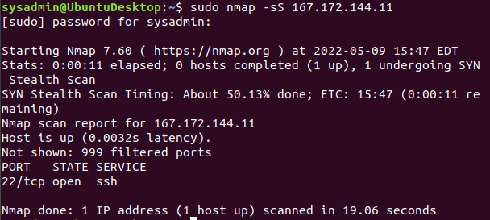

## Week 8 Homework Submission File: Networking Fundamentals 

Please edit this file by adding the solution commands on the line below the prompt. 

Save and submit the completed file for your homework submission.

Phase 1: "I'd like to Teach the World to Ping"

a) The steps and commands used to complete the tasks.

b) A summary of your findings for each testing phase.

c) Any network vulnerabilities discovered.

167.172.144.11 on the Hollywood application server is currently open and accepting connections. Since Rockstar Corp doesn't want any requests, this is a vulnerability.

d) Findings associated with a hacker.

More research needs to be done to determine if this open IP address was the result of a hacker or setup error. 

e)Recommended mitigation strategy.

Close the IP address and research who set it up and analyze all internet traffic to the IP address while it was open. 

f) Document the OSI layer where the findings were found.

This is in OSI layer 3 where the destination IP is added to the package. 

Phase 2:  "Some Syn for Nothin`"

a) List the steps and commands used to complete the tasks.

b) A summary of your findings for each testing phase.

According the Nmap port 22 is open and accepting connections 

c) List any vulnerabilities discovered.

Potentional vulnerability as Port 22 should not be open.

d) List any findings associated to a hacker.

Port 22 is a common port used by hackers and is closed on most systems for this reason. 

e) Document the mitigation recommendations to protect against the discovered vulnerabilities.

This port needs to be closed as it makes the entire system vulnerable and allows a hacker to ssh into the system undetected. 

f) Document the OSI layer where the findings were found.

OSI Layer 4 Transport layer

Phase 3 

a) List the steps and commands used to complete the tasks.

b) A summary of your findings for each testing phase.

c) List any vulnerabilities discovered.

d) List any findings associated to a hacker.

e) Document the mitigation recommendations to protect against the discovered vulnerabilities.

f) Document the OSI layer where the findings were found.

Phase 4

a) List the steps and commands used to complete the tasks.

b) A summary of your findings for each testing phase.

c) List any vulnerabilities discovered.

d) List any findings associated to a hacker.

e) Document the mitigation recommendations to protect against the discovered vulnerabilities.

f) Document the OSI layer where the findings were found.

