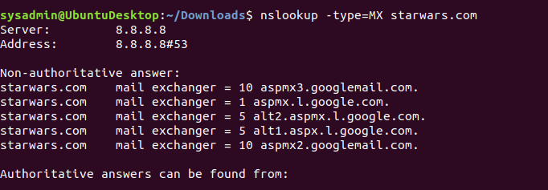
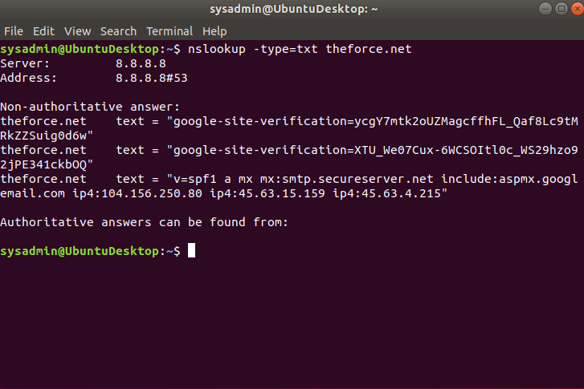
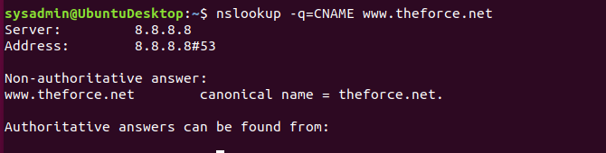
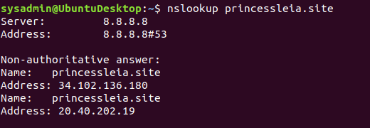

## Week 9 Homework Submission File: Networking Fundamentals II 

Please edit this file by adding the solution commands on the line below the prompt.

Save and submit the completed file for your homework submission.

---

Mission 1

Determine and document the mail servers for starwars.com using NSLOOKUP.

Explain why the Resistance isn't receiving any emails.

        The correct primary and secondary email servers for starwars.com are asltx.l.google.com and asltx.2.google.com

Document what a corrected DNS record should be.

        server: 8.8.8.8
        address: 8.8.8.8#53

        Non-authoritative answer: 
        starwars.com mail exchanger = asltx.l.google.com starwars.com mail exchanger = asltx.2.google.com

Mission 2

Determine and document the SPF for theforce.net using NSLOOKUP.

Explain why the Force's emails are going to spam.

        The mail exchange server has listed theforce.net IP address of 45.23.176.21 on a list of known spam senders. 

Document what a corrected DNS record should be.

    Server:		8.8.8.8
    Address:	8.8.8.8#53

    Non-authoritative answer:
    google.com	text = "v=spf1 include:_spf.theforce.net ~all"

Mission 3

Document how a CNAME should look by viewing the CNAME of www.theforce.net using NSLOOKUP.

Explain why the sub page of resistance.theforce.net isn't redirecting to theforce.net.

    The resistance.theforce.net is not listed as a cname for in the nds server for theforce.net so queries for that site is not being forwarded to theforce.net. 

Document what a corrected DNS record should be.

    Non-authoritative answer: 
    www.resistance.theforce.net

 Mission 4

  Confirm the DNS records for princessleia.site.

Document how you would fix the DNS record to prevent this issue from happening again.  